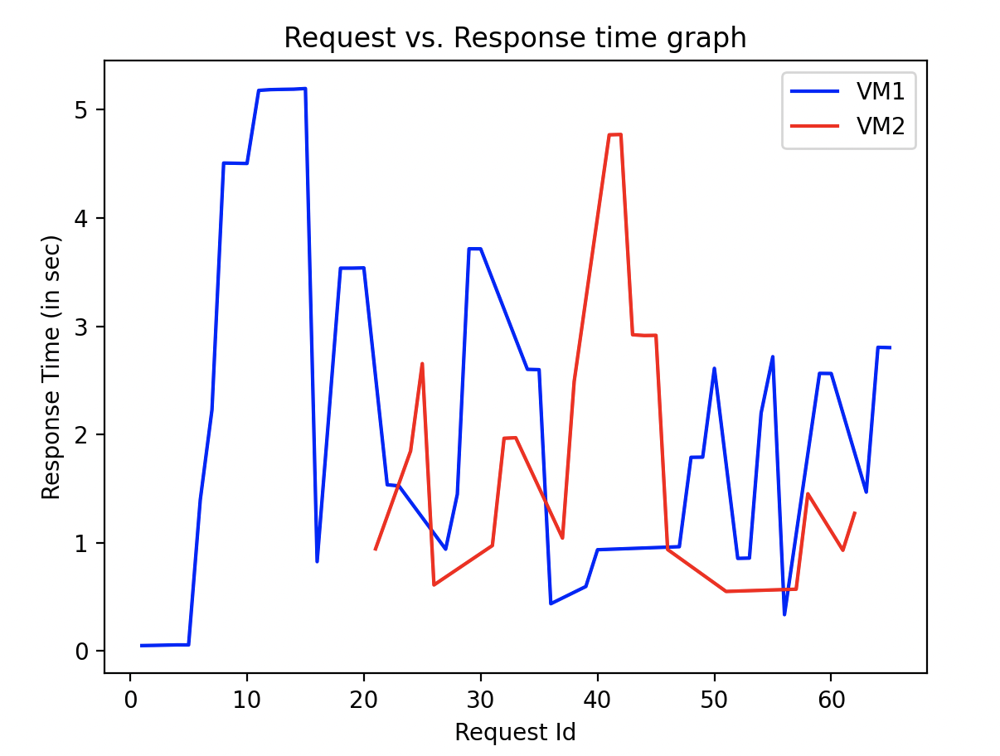

# Output Logs
There are two main logs in this project namely the client logs and the autoscalar logs. Using the autoscalar logs the following graph was ploted (By running plot-log.py).

Here we can see that around the 10th request the VM1 was overloaded and that triggered the launch of VM2. The response time to high load initially (when handled solely by VM1) is about 5s. After the launch of VM2 it can be noticed that the overall response time (around 2-3s) is much lower than the initial response time at high load. 

**Note:** The erratic nature of the graph is because every backend call is requesting for a different nth fibonacci number, for higher inputs the processing time is much more.

## Client Logs
The following details are logged by the client
1. Start and end of a thread
2. The result of the backend along with name of the VM that returned the result.
3. Messages received from the autoscaler

## Autoscaler Logs
The following details are logged by the autoscaler
1. CPU usage for each VM along with a time stamp
2. Logging of when a new VM is launched